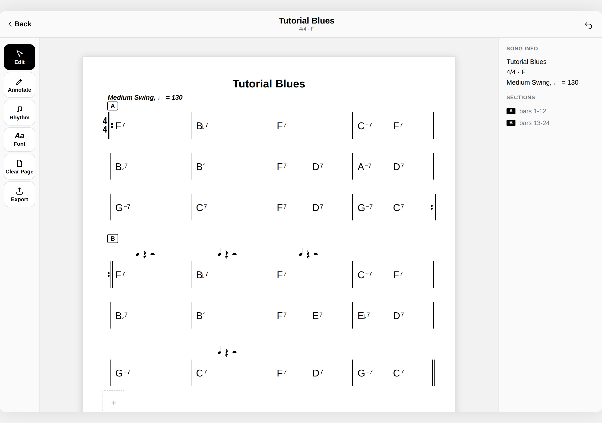
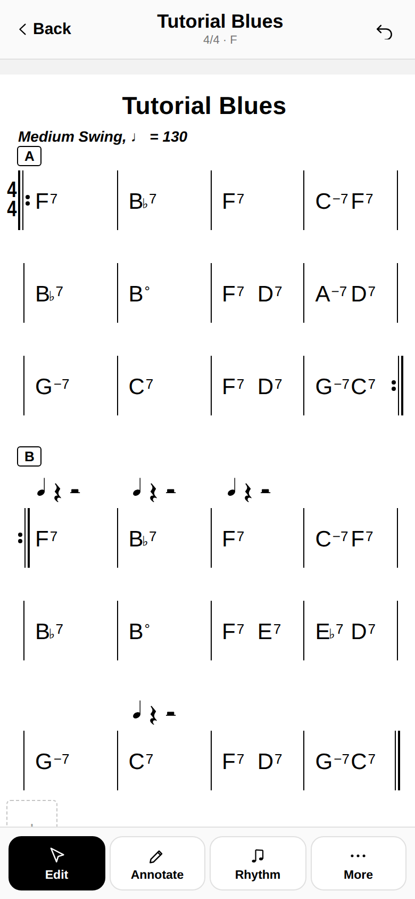

# Lead Sheet Editor

A mobile-first PWA for writing and editing musical lead sheets (chord charts) right on your phone. Tap in chords and bars, add sections and rhythm notation, then export a clean, engraved chart as PNG, PDF, or JSON.

## Live Demo
https://hadareal.github.io/leadsheet-editor/

## Features
- Bar-by-bar chord chart editing with sections, repeats, and time signatures
- Engraved music notation rendering (chord symbols, barlines, rhythm glyphs) in the style of the Bravura/Petaluma music fonts
- Freehand ink annotations directly on the chart
- Undo history while editing
- Export to PNG, PDF (via print), or JSON, with JSON re-import to keep editing later
- Installable as a Progressive Web App with offline support for the core app

## Screenshots

## Tech Stack

- HTML
- CSS
- JavaScript (vanilla — no framework, no bundler, no build step)
- Service Worker + Web App Manifest (PWA/offline support)
- SVG (hand-coded music notation glyphs)
